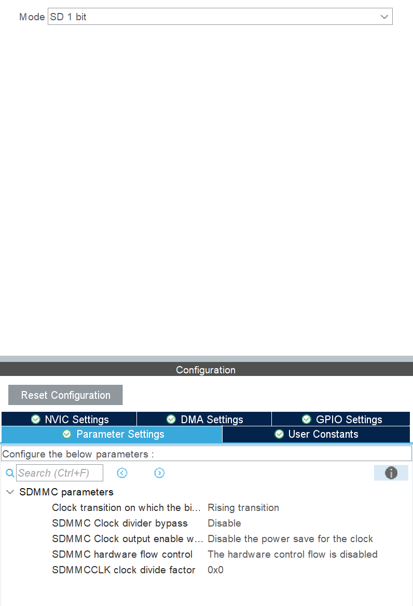
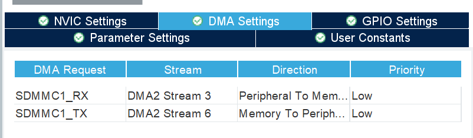
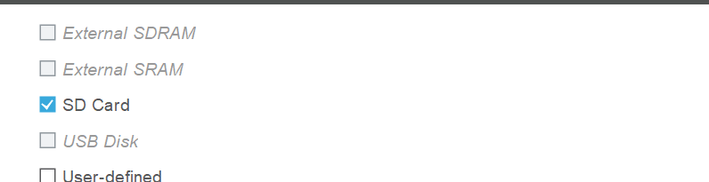
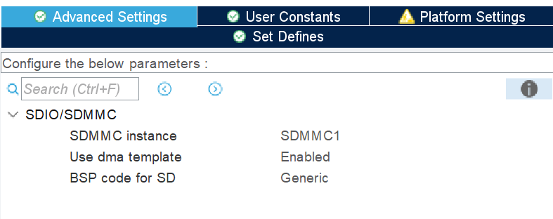
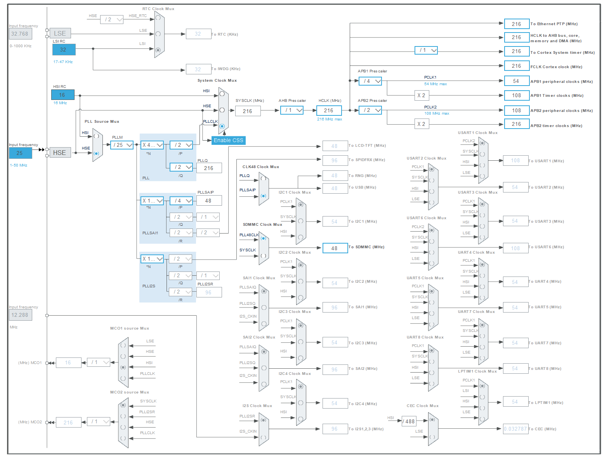

# USB_MSC-uSD

## CONFIG SDMMC

- Chọn cấu hình bên file `.ioc` với cấu hình **1bit**

<p align="center">
  
</p>

- Kích hoạt DMA ở cả TX với RX

<p align="center">
  
</p>

- Thêm đoạn code cấu hình sdmmc **4bit** trong scope comment `/* USER CODE BEGIN 2 */` và `/* USER CODE END 2 */`

```C
	if (HAL_SD_Init(&hsd1) != HAL_OK)
	{
		Error_Handler();
	}

	if (HAL_SD_ConfigWideBusOperation(&hsd1, SDMMC_BUS_WIDE_4B) != HAL_OK)
	{
		Error_Handler();
	}
```

## CONFIG FATFS

- Kích hoạt FATFS trên `cubeMX`

<p align="center">
  
</p>

- Kích hoạt DMA

<p align="center">
  
</p>

## CONFIG CLOCK

<p align="center">
  
</p>
